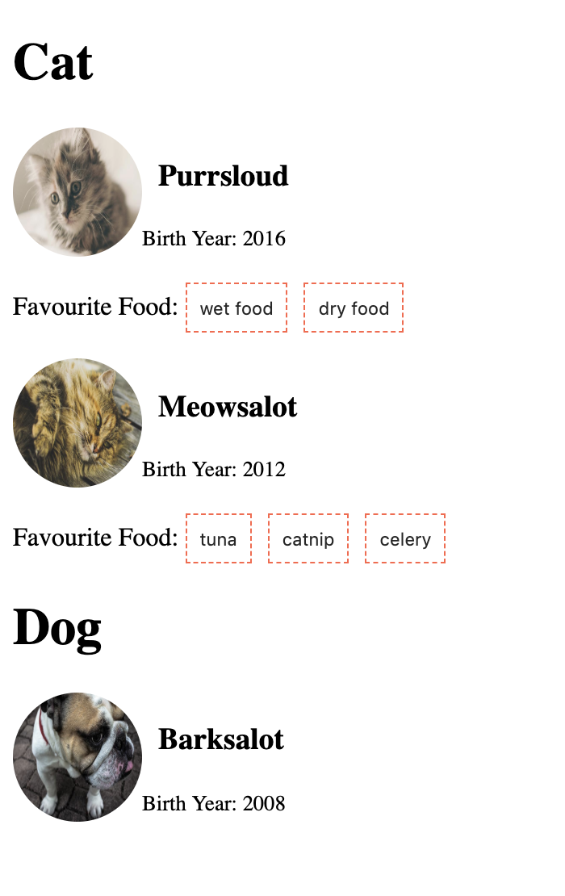

# Understanding the use of props

```js
{
  "pets": [
    {
      "name" : "Purrsloud",
      "species" : "Cat",
      "favFoods" : ["wet food", "dry food", "<strong>any</strong> food"],
      "birthYear" : 2016,
      "photo" : "https://learnwebcode.github.io/json-example/images/cat-2.jpg"
    },
    {
      "name" : "Barksalot",
      "species" : "Dog",
      "birthYear" : 2008,
      "photo" : "https://learnwebcode.github.io/json-example/images/dog-1.jpg"
    },
    {
      "name" : "Meowsalot",
      "species" : "Cat",
      "favFoods" : ["tuna", "catnip", "celery"],
      "birthYear" : 2012,
      "photo" : "https://learnwebcode.github.io/json-example/images/cat-1.jpg"
    }
  ]
}
```

Use the above data and display it in different section according to the species. One section will contain all the pets of `Cat` species and another will contain of `Dog`.

Mkae it looke someting like this with better UI 👍

